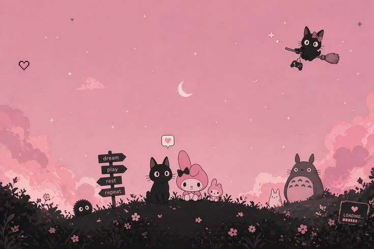

  

  
  

 

<table align="center" border="0" cellpadding="0" cellspacing="0" width="100%">
  <tr>
    <td valign="top" width="65%">
      <h1>Olá! Eu sou a Amanda Costa 👋</h1>
      

        <strong>Desenvolvedora Frontend & Mobile</strong> 
        <em>Especialista em construir interfaces modernas, fluidas e de alta performance.</em>
      

      

        Sou uma desenvolvedora focada no ecossistema JavaScript, com forte experiência na criação de aplicações híbridas utilizando <strong>React Native</strong> e <strong>Expo</strong>. Minha paixão é transformar designs e conceitos complexos em códigos limpos, componentizados e em experiências de usuário excepcionais.
      

      

        💼 Dedicada a construir layouts responsivos, focados em usabilidade, performance e boas práticas de desenvolvimento de software.
      

    </td>
    <td valign="middle" width="35%" align="center">
      <!-- Corrigido para .jpg conforme seu repositório -->
      
    </td>
  </tr>
</table>

 

<h2 align="center">Ferramentas & Tecnologias</h2>

  
  
  
  
  
   

  
  
  

 

  
  

